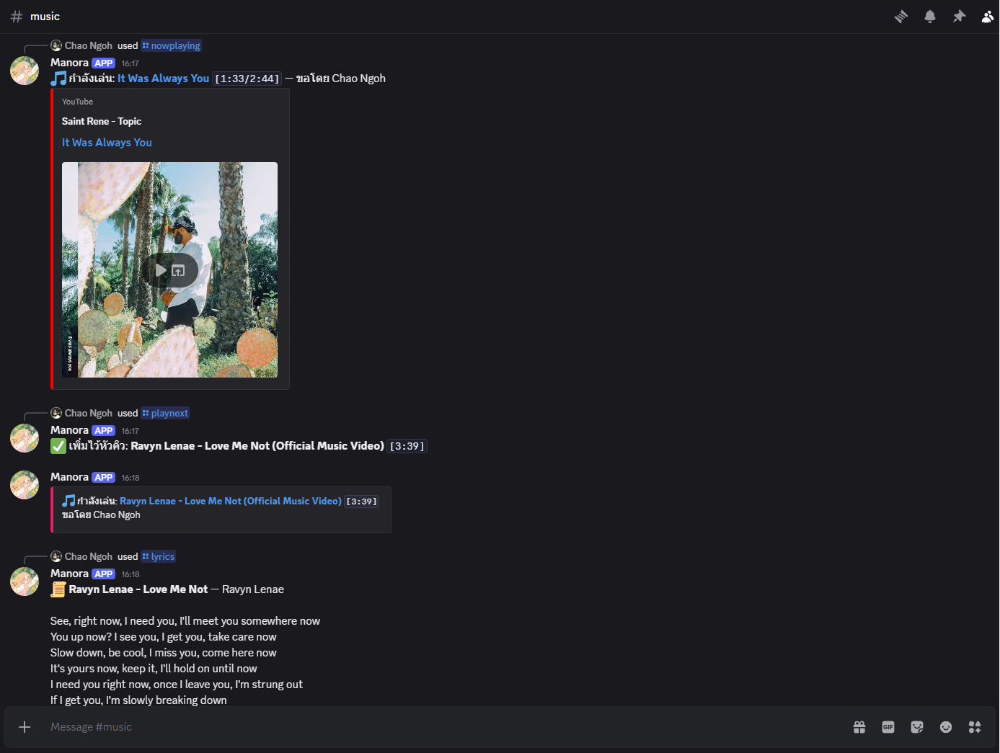

# Manora — Discord Music Bot

Discord music bot that streams YouTube audio directly via yt-dlp — paste a link or search by name, plays continuously in a queue with no ads.

## Screenshots



## Features

- **YouTube Playback**: Play from a video link, playlist link, or search by name
- **Queue**: Add songs continuously — auto-queues without interruption, no ads
- **Autoplay**: When the queue runs out, automatically finds and plays related tracks like YouTube autoplay
- **Loop / Shuffle**: Loop a single track or the entire queue, shuffle queue order
- **Volume Control**: 0–200%
- **Lyrics**: Fetch lyrics for the currently playing song

## Installation

1. **Clone the Repository**
   ```bash
   git clone https://github.com/NsamaX/Discord-Music-Bot.git
   ```

2. **Prerequisites**
   - Node.js 22+
   - `yt-dlp` and `ffmpeg` available in PATH (or set `YTDLP_PATH` / `FFMPEG_PATH` in `.env`)
   - Create a Discord Application at the [Discord Developer Portal](https://discord.com/developers/applications) — save the Bot Token, Application ID, and Server ID

3. **Set Up**
   ```bash
   npm install
   cp .env.example .env
   ```

   | Variable | Required | Description |
   |:---|:---:|:---|
   | `DISCORD_TOKEN` | yes | Bot token from Discord Developer Portal |
   | `DISCORD_CLIENT_ID` | yes | Application ID |
   | `DISCORD_GUILD_ID` | yes | Server ID |
   | `YTDLP_PATH` | no | Path to yt-dlp binary (default: looks in PATH) |
   | `FFMPEG_PATH` | no | Path to ffmpeg binary (default: looks in PATH) |

   Register slash commands (first time only):
   ```bash
   npm run deploy
   ```

4. **Run**
   ```bash
   npm start       # production
   npm run dev     # development (auto-reload)
   ```

   Join a voice channel first, then use `/play` in any text channel — the bot will join and start playing.

## Demo

| Command | Description |
|:---|:---|
| `/play <link or playlist>` | Play from a YouTube link (playlist adds all tracks) |
| `/play <song name>` | Search YouTube and play the top result |
| `/playnext <song name>` | Insert a song at the front of the queue |
| `/lyrics` | Show lyrics for the currently playing song |
| `/skip` | Skip the current track |
| `/pause` / `/resume` | Pause / resume playback |
| `/queue` | View the current queue |
| `/nowplaying` | Show the currently playing track |
| `/shuffle` | Shuffle the queue |
| `/loop` | Cycle loop mode: off / single track / full queue |
| `/autoplay` | Toggle autoplay when the queue ends (on by default) |
| `/remove` | Remove a track by its position in `/queue` |
| `/volume` | Set volume 0–200% (default 100) |
| `/stop` | Stop playback, clear queue, and leave the channel |

**Limitations**
- YouTube only — Spotify and SoundCloud are not supported
- You must be in a voice channel before using `/play`
- Autoplay tracks are selected via YouTube Mix — use `/skip` or `/play` to override
- `/lyrics` uses LRCLIB — popular tracks are well covered, but indie or low-view tracks may not be found
- Volume adjustments may cause a brief audio stutter
- If a valid link fails to play, restart the container to pull the latest yt-dlp (YouTube changes its systems periodically)

## License

This project is licensed under the **MIT License**.
